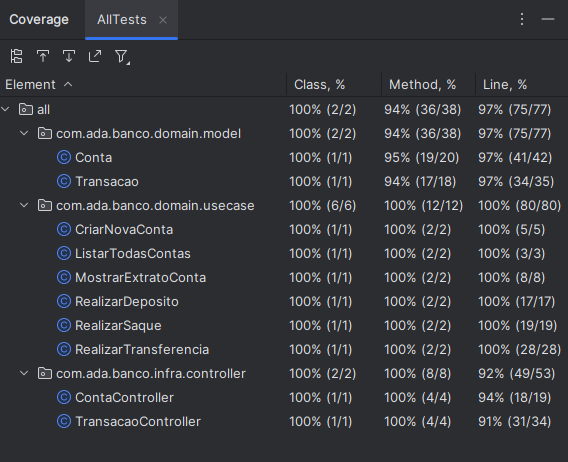

# Testes Automatizados I - Projeto Bank

## Objetivo

Dando continuidade ao código abordado em sala de aula [Banco](https://github.com/igorsmasc/banco-alunos), implementando os requisitos funcionais estabelecidos abaixo e realizar todos os testes necessários.

### Requisitos funcionais

1. **Cadastro de Clientes:** Os usuários devem ser capazes de se cadastrar no sistema fornecendo informações como nome e CPF (outros dados são opcionais).

2. **Contas Bancárias:** Cada cliente pode abrir apenas uma conta. As contas devem ter um número único, tipo de conta (corrente ou poupança) e saldo.

3. **Transações:** Os clientes devem ser capazes de realizar depósitos e saques em suas contas. As transferências entre contas também devem ser suportadas.

4. **Histórico de Transações:** Um histórico de transações deve ser mantido para cada conta, mostrando todas as operações realizadas.

### Critérios de avaliação

1. **Utilização do JUnit 5:** Certifique-se de implementar testes utilizando o framework `JUnit 5` para garantir a robustez do seu código.

2. **Cobertura de 90% (Linhas):** Busque alcançar uma cobertura de código de, no mínimo, 90%, assegurando que a maioria dos cenários seja abordada pelos testes.

3. **Cumprimento de todos os requisitos:** Atente-se para cumprir todas os requisitos estabelecidas no código, garantindo que a implementação siga as diretrizes previamente definidas.

4. **Aplicação dos conceitos discutidos em sala de aula:** O aluno deve demonstrar habilidade na utilização de diversos tipos de assertivas, anotações, mocks, bem como realizar testes unitários, de integração e `end-to-end` (`E2E`), aderindo ao princípio `F.I.R.S.T`.

## Resultado

### Considerações
O principal foco desse projeto final está em aplicar os conceitos sobre testes discutidos em aula.

Ainda assim é necessário ter conhecimento dos módulos anteriores para realizar a implementação de um API bem simplificada de um banco.

Nesse projeto foi usada a [arquitetura hexagonal](https://engsoftmoderna.info/artigos/arquitetura-hexagonal.html) com intuito de dividir as classes do projeto em dois grupos macros:
- Classes de domínio (pacote `domain` do projeto): são classes relacionadas aos modelos (pacote `domain.model` do projeto) e às regras de negócio do projeto (pacote `domain.usecase` do projeto).
- Classes de infraestrutura (pacote `infra` do projeto): são classes responsáveis pela integração com banco de dados (pacote `infra.gateway.bd` do projeto) e porta de entrada do projeto (pacote `infra.controller` do projeto).

As classes do pacote `domain.model` receberam anotação `@Entity` do `Sprint Data JPA`, essas classes não deveriam depender de classes relacionadas a tecnologias, mas para simplificar a implementação, foi feita essa pequena adaptação.

Uma das dificuldade que encontrei ao fazer o projeto foi a parte dos testes de integração, que nesse caso servem como teste end-to-end pelo porte pequeno do projeto.
Mais especificamente encontrar uma forma de reiniciar o banco de dados de tal modo que as sequências dos `ids` das tabelas também são reiniciadas. A solução encontrada foi rodar um script `SQL` que faz o truncamento das tabelas reiniciando os `ids` antes de cada teste.

Implementei no total de **32** testes, sendo **20** testes unitários e **12** testes de integração / `end-to-end`.

### Coverage


[Link](coverageReport/index.md) para relatório de coverage gerado pelo Intellij.

### Possíveis melhorias
- Criar classes de constantes de `String` para centralizar os textos das mensagens e os caminhos dos `endpoints`
- Documentar os `endpoints` do projeto usando [springdoc-openapi](https://central.sonatype.com/search?q=springdoc-openapi-starter-webmvc-ui)
- Implementar sistema de autenticação


## API Endpoints
### Endpoints
| Método HTTP | Endpoint | Ação |
| --- | --- | --- |
| GET | /bank-api/v1/contas | Traz uma lista contendo todas contas cadastradas no banco |
| GET | /bank-api/v1/contas/extrato?agencia=:agencia&digito=:digito&conta=:conta | Traz o extrato (uma lista de transações) de uma conta |
| POST | /bank-api/v1/contas | Cadastra uma nova conta |
| POST | /bank-api/v1/transacao/depositar | Realiza um depósito |
| POST | /bank-api/v1/transacao/sacar | Realiza um saque |
| POST | /bank-api/v1/transacao/transferir | Realiza uma transferência |

### Exemplos de request e response

#### GET `/bank-api/v1/contas`
**Response**
```Json
[
    {
        "id": 1,
        "agencia": 1,
        "digito": 1,
        "saldo": 100.00,
        "titular": "Ada",
        "cpf": "11122233344",
        "tipoConta": "POUPANCA"
    },
    {
        "id": 2,
        "agencia": 1,
        "digito": 1,
        "saldo": 200.00,
        "titular": "Ada",
        "cpf": "11122233355",
        "tipoConta": "CONTA_CORRENTE"
    }
]
```

#### GET `/bank-api/v1/contas/extrato?agencia=1&digito=1&conta=1`
**Response**
```Json 
[
    {
        "id": 1,
        "dataHora": "2023-11-26T13:33:55.601+00:00",
        "conta": {
            "id": 1,
            "agencia": 1,
            "digito": 1,
            "saldo": 45.00,
            "titular": "Ada",
            "cpf": "11122233344",
            "tipoConta": "POUPANCA"
        },
        "contaDestino": null,
        "valor": 10.00,
        "tipoTransacao": "DEPOSITO"
    },
    {
        "id": 2,
        "dataHora": "2023-11-26T13:34:32.285+00:00",
        "conta": {
            "id": 1,
            "agencia": 1,
            "digito": 1,
            "saldo": 45.00,
            "titular": "Ada",
            "cpf": "11122233344",
            "tipoConta": "POUPANCA"
        },
        "contaDestino": null,
        "valor": 20.00,
        "tipoTransacao": "SAQUE"
    },
    {
        "id": 3,
        "dataHora": "2023-11-26T13:35:11.805+00:00",
        "conta": {
            "id": 1,
            "agencia": 1,
            "digito": 1,
            "saldo": 45.00,
            "titular": "Ada",
            "cpf": "11122233344",
            "tipoConta": "POUPANCA"
        },
        "contaDestino": {
            "id": 2,
            "agencia": 1,
            "digito": 1,
            "saldo": 245.00,
            "titular": "Ada",
            "cpf": "11122233355",
            "tipoConta": "CONTA_CORRENTE"
        },
        "valor": 45.00,
        "tipoTransacao": "TRANSFERENCIA"
    }
]
```

#### POST `/bank-api/v1/contas`
**Request Body**
```Json
{
    "agencia": 1,
    "digito": 1,
    "saldo": 100.0,
    "titular": "Ada",
    "cpf": "11122233344",
    "tipoConta": "POUPANCA"
}
```
```Json
{
    "agencia": 1,
    "digito": 1,
    "saldo": 200.0,
    "titular": "Ada",
    "cpf": "11122233355",
    "tipoConta": "CONTA_CORRENTE"
}
```
    
**Response**
```Json
{
    "status": 201,
    "data": {
        "id": 1,
        "agencia": 1,
        "digito": 1,
        "saldo": 100.0,
        "titular": "Ada",
        "cpf": "11122233344",
        "tipoConta": "POUPANCA"
    },
    "message": "Nova conta criada com sucesso!"
}
```

```Json
{
    "status": 201,
    "data": {
        "id": 2,
        "agencia": 1,
        "digito": 1,
        "saldo": 200.0,
        "titular": "Ada",
        "cpf": "11122233355",
        "tipoConta": "CONTA_CORRENTE"
    },
    "message": "Nova conta criada com sucesso!"
}
```

#### POST `/bank-api/v1/transacao/depositar`
**Request Body**
```Json
{
    "conta": {
        "id": 1,
        "agencia": 1,
        "digito": 1
    },
    "valor": 10.0
}
```

**Response**
```Json
{
    "status": 200,
    "data": {
        "id": 1,
        "dataHora": "2023-11-26T13:33:55.601+00:00",
        "conta": {
            "id": 1,
            "agencia": 1,
            "digito": 1,
            "saldo": 110.00,
            "titular": "Ada",
            "cpf": "11122233344",
            "tipoConta": "POUPANCA"
        },
        "contaDestino": null,
        "valor": 10.0,
        "tipoTransacao": "DEPOSITO"
    },
    "message": "Depósito realizado com sucesso!"
}
```

#### POST `/bank-api/v1/transacao/sacar`
**Request Body**
```Json
{
    "conta": {
        "id": 1,
        "agencia": 1,
        "digito": 1
    },
    "valor": 20.0
}
```

**Response**
```Json
{
    "status": 200,
    "data": {
        "id": 2,
        "dataHora": "2023-11-26T13:34:32.285+00:00",
        "conta": {
            "id": 1,
            "agencia": 1,
            "digito": 1,
            "saldo": 90.00,
            "titular": "Ada",
            "cpf": "11122233344",
            "tipoConta": "POUPANCA"
        },
        "contaDestino": null,
        "valor": 20.0,
        "tipoTransacao": "SAQUE"
    },
    "message": "Saque realizado com sucesso!"
}
```

#### POST `/bank-api/v1/transacao/transferir`
**Request Body**
```Json
{
    "conta": {
        "id": 1,
        "agencia": 1,
        "digito": 1
    },
    "contaDestino": {
        "id": 2,
        "agencia": 1,
        "digito": 1
    },
    "valor": 45.0
}
```

**Response**
```Json
{
    "status": 200,
    "data": {
        "id": 3,
        "dataHora": "2023-11-26T13:35:11.805+00:00",
        "conta": {
            "id": 1,
            "agencia": 1,
            "digito": 1,
            "saldo": 45.00,
            "titular": "Ada",
            "cpf": "11122233344",
            "tipoConta": "POUPANCA"
        },
        "contaDestino": {
            "id": 2,
            "agencia": 1,
            "digito": 1,
            "saldo": 245.00,
            "titular": "Ada",
            "cpf": "11122233355",
            "tipoConta": "CONTA_CORRENTE"
        },
        "valor": 45.0,
        "tipoTransacao": "TRANSFERENCIA"
    },
    "message": "Transferência realizada com sucesso!"
}
```
